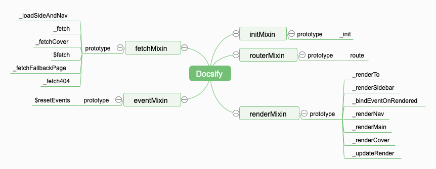
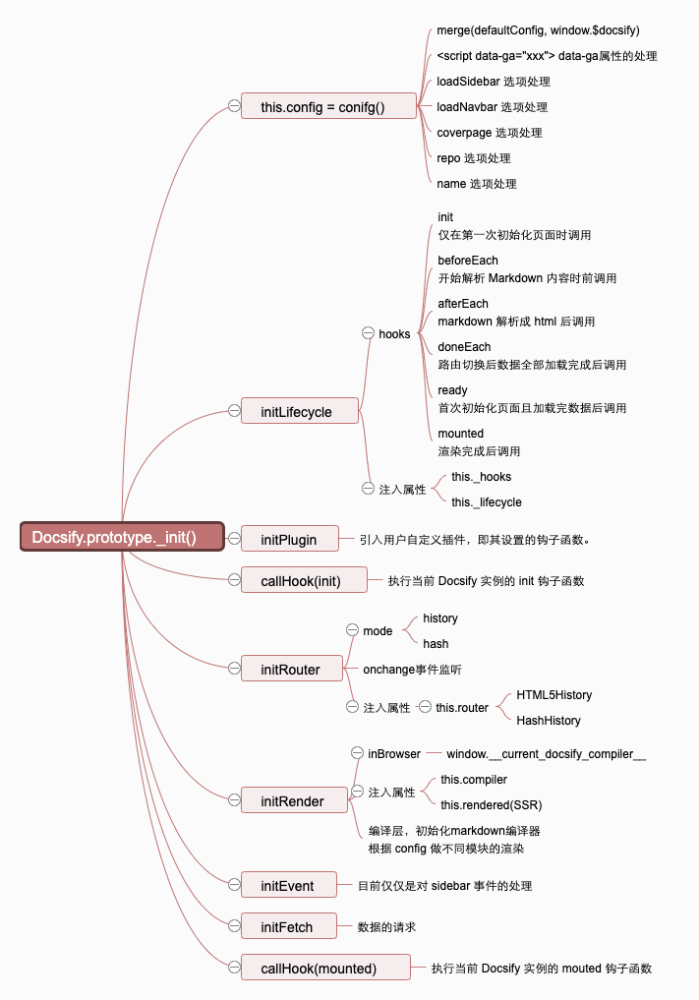

# Home

> 也许这里会有一些你感兴趣的东西。

> 分析一款不依赖于任何框架的产品，也许会对你有用。（也许没什么卵用🤣）

> 因为我工作中会经常书写 Markdown 文档，所以我希望对这个工具 ([docsify](https://github.com/docsifyjs/docsify)) 有足够的了解😀。

### Local preview in your browser

```sh
git clone https://github.com/lotteryjs/docsify.lotteryjs.com.git
cd docsify.lotteryjs.com
docker-compose up -d
```

[http://localhost:4000](http://localhost:4000)

### To-Do List 

Everything start with `this._init()`

优雅使用 vanilla JavaScript 完成你的项目（逻辑记忆）

- config (加载配置)
  - 合并配置(window.$docsify)
  - 处理 script 标签中的 `data-*` 属性配置
  - 处理 `loadSidebar` 配置项(侧边栏)
  - 处理 `loadNavbar` 配置项(导航栏)
  - 处理 `coverpage` 配置项(封面)
  - 处理 `repo` 配置项(GitHub角标)
  - 处理 `name` 配置项(文档名称)
- initLifecycle(Init hooks)
  - 定义 `docsify` 实例各个阶段的 hooks，方便扩展
    - `init`,`mounted`,`beforeEach`,`afterEach`,`doneEach`,`ready`
    - 设计基于这些 hooks 的扩展机制
- initPlugin(Install plugins)
  - 安装用户的插件，也就是装载用户在的各个扩展点（hooks）自定义函数
- callHook(`init` hook)
  - 执行用户在 `init` 扩展点的所有自定义函数
- initRouter(Add router)
  - HTML5History
    - `popstate` 事件
  - HashHistory
    - `hashchange` 事件
- initRender(Render base DOM)
  - Init markdown compiler
  - `repo` ? 
  - `coverpage` ?
  - `logo` ?
  - `mergeNavbar` ?
  - `loadNavbar` ?
  - `themeColor` ?
  - `nameLink` ?
- initEvent(Bind events)
  - siderbar
  - scroll
- initFetch(Fetch data)
  - XMLHttpRequest
  - progressbar
- callHook(`mounted` hook)
  - 执行用户在 `mounted` 扩展点的所有自定义函数


#### Docsify Core


### Mind maps

1. Docsify Mixin：为 Docsify() 注入原型方法。



2. Docsify.prototype._init



### Refs

* [docs-ssr](https://github.com/lotteryjs/docs-ssr)
* [Docsify 深入源码](https://mp.weixin.qq.com/s/Sb0bMNz1PdmGgFF_W5sZDA?)